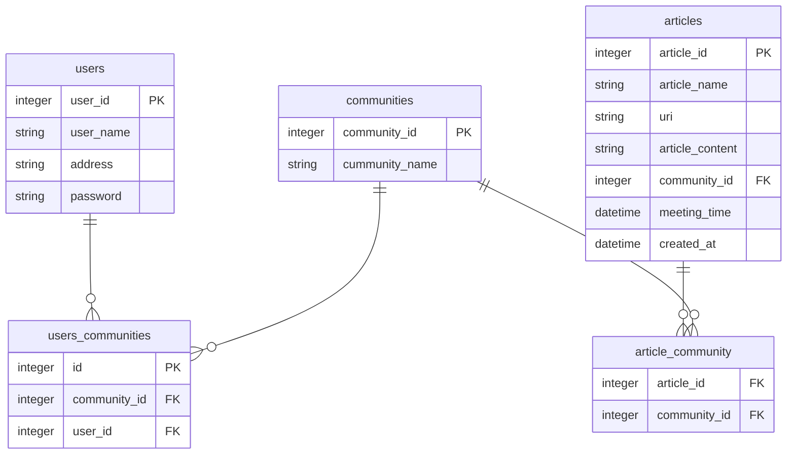

# サンプル（プロダクト名）

[](https://www.youtube.com/watch?v=LUPQFB4QyVo)

## 製品概要
### 背景(製品開発のきっかけ、課題等）
  - 日常的に料理やお菓子を作るが他の人に食べてもらう機会は少ない
  - 「自分から食べて!」と頼むのはなかなか
  - コロナが落ち着いてきたとはいえ、友達やコミュニティ同士のつながりが前に比べると薄い
  - 毎度外食すると金銭的な負担が大きい
  - 大学生や新社会人などは宅飲みなどで仲良くなることが多い
  - 毎度今日の予定どう？って聞くのはめんどくさい上に聞いた人に断られると次の人に聞く必要がある
  
### 製品説明（具体的な製品の説明）
料理を作る人(以降:募集者)がいまからこんなのつくります!というのを宣言することで、その人と同じコミュニティに参加している人に通知が送られる。  
その通知に対して、「行く」と返事するとその人の住所と何時ごろに出来上がるかを確認でき、実際に参加する人(以降:参加者)だけのチャットが表示される。  
またチャットの中で募集者が買ってきて欲しいもの(飲み物とか調味料など)が表示されており、参加者はこれを自分買っていきますなどを話したりすることができる。  
### 特長
#### 1. 特長1
コミュニティを選ぶだけで、いちいち個人的に誘う必要がない
#### 2. 特長2
何時ごろに出来上がるなどがわかるので、細かい時間を設定する必要がない
#### 3. 特長3
店などで食べたりしないので、金銭的な負担も少ない
#### 4. 特徴4
コミュニティ外の人には募集は表示されないので知らない人同士がくっつくことはなく、気まずいなどが起こらない。

### 解決出来ること
- コロナ禍でのコミュニティのつながりの薄さを解消できる
- だれを誘うかや何時にどうするなどの細かい予定を立てる手間を省くことができる
- 募集者は料理などに集中するだけでよく、追加で必要な飲み物なども表示されるので、来る人も募集者になにいるー？とかを聞く手間を省くことができる
### 今後の展望
### 注力したこと（こだわり等）
* 
* 

## 開発技術
- バックエンド・インフラ
  - python
    - Django
  - AWS
  - postgresql
- フロント
### 活用した技術
#### API・データ
* 
* 

#### フレームワーク・ライブラリ・モジュール
* Django
* 

#### デバイス
* 
* 

### 独自技術
#### ハッカソンで開発した独自機能・技術
* 独自で開発したものの内容をこちらに記載してください
* 特に力を入れた部分をファイルリンク、またはcommit_idを記載してください。

#### 製品に取り入れた研究内容（データ・ソフトウェアなど）（※アカデミック部門の場合のみ提出必須）
* 
* 


# バックエンド
### セットアップできているかの確認作業
1. `make dc/up-build`でコンテナ作成
2. `cd backend && make ls-docker-db`バックエンドに移動してデータベースの確認をする。`\l`で`sokuseki_db`dbが作成されているか確認
3. adminURL`http://localhost:8000/admin/`でログインページでたらOK





## API 
- /users POST ユーザ名を作成する
- /users/:id       GET ユーザ情報を取得
- /users/:id/articles GET ユーザが投稿した料理一覧
- /users/:id/articles/:article_id GET ユーザが投稿した料理
- /communities POST コミュニティ作成
- /communities GET コミュニティ一覧
- /communities/:id    GET コミュニティを取得
- /communities/:id/users GET 参加する人(数)


### shellでAPI試す流れ
1. docker起動`make dc/up-build`
2. backend/で`make migration`と`make migrate`
3. backedn/ `make shell`でdjangoのshellに入る
4. 下をコピーしてシェルに貼り付けて実行
```
from rest_api.models import User, Community
from rest_api.serializer  import UserSerializer, CommunitySerializer
from rest_framework.renderers import JSONRenderer
from rest_framework.parsers import JSONParser
user = User(password="password", email="test@example.com", user_name="test_user", address="test address")
community_1 = Community(community_name="test community 1")
community_1.save()
user.save()
userserializer2 = UserSerializer(user2)
userserializer2.data
user2 = User(password="password2", email="test2@example.com", user_name="test_user_2", address="test address")
user2.save()
userserializer2 = UserSerializer(user2)
userserializer2.data
community_sel = CommunitySerializer(community_1)
community_sel.data
```
5. backend/ `make check-user`でユーザ情報`make check-community`コミュニティ確認